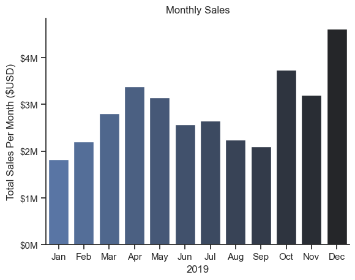
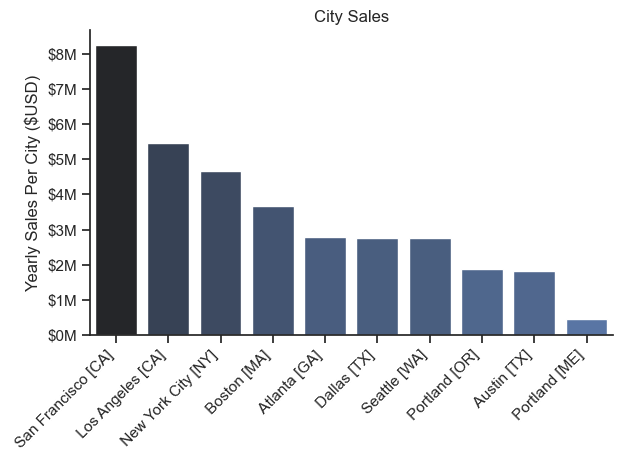
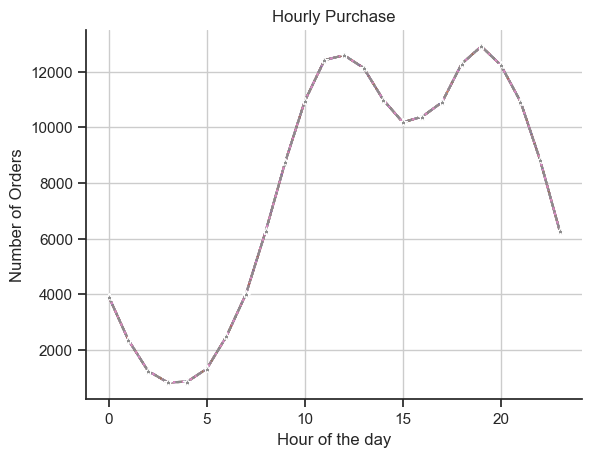
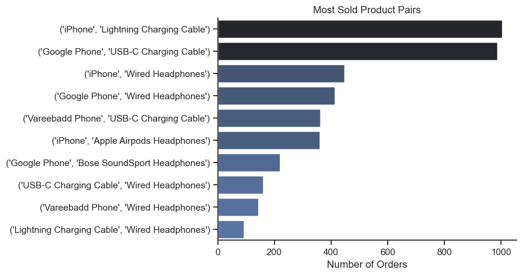

# Overview
This project analyzes 12 months of sales data to identify trends, patterns, and key performance indicators (KPIs). The analysis includes data cleaning, exploratory data analysis, time series analysis, segmentation. The goal is to gain valuable insights into sales performance and generate actionable recommendations for business improvement.

# Tools I used
- Programming Languages: Python (with libraries like Pandas)
- Data Visualization Libraries: Matplotlib, Seaborn.

# Analysis
## 1. What are Monthly Sales and how it differs over the year?

### Visualize Data
```python

sns.set_theme(style="ticks")
sns.barplot(data=df_monthly_sales, x='Month', y='Total Price', hue='Month', palette='dark:b_r')
plt.title('Monthly Sales')
plt.xlabel('2019')
plt.ylabel('Total Sales Per Month ($USD)')
ax = plt.gca()
ax.yaxis.set_major_formatter(plt.FuncFormatter(lambda x, loc: f'${int(x/1000000)}M'))
sns.despine()
plt.show()

```

### Results 


### Insights 

- Seasonal Fluctuations: There's a clear peak in sales during December, suggesting a strong holiday season influence. This could be due to increased consumer spending during the festive season.
- Month-to-Month Variation: Sales fluctuate from month to month, with some months experiencing higher sales than others. This variation could be due to various factors like seasonal demand, marketing campaigns, or economic conditions.

### Business Strategies 

- Holiday Promotions: Leverage the high demand during the holiday season by offering attractive promotions and discounts.
- Targeted Promotions: Run targeted promotions or campaigns during low-performing months to stimulate demand.
- Inventory Management: Ensure adequate inventory levels to meet the increased demand during peak months.


## 2. What are the sales according to the city?

### Visualize Data
```python

sns.set_theme(style='ticks')
sns.barplot(data=df_city_sales, x='City', y='Total Price', hue='Total Price', palette='dark:b_r', legend=False)
plt.title('City Sales')
plt.xlabel('')
plt.ylabel('Yearly Sales Per City ($USD)')
plt.xticks(rotation=45, ha='right')
ax = plt.gca()
ax.yaxis.set_major_formatter(plt.FuncFormatter(lambda x, loc: f'${int(x/1000000)}M'))
sns.despine()
plt.tight_layout()
plt.show()

```

### Results 


### Insights 

- Top-Performing Cities: San Francisco and Los Angeles are the top-performing cities, with significantly higher sales compared to other cities. This indicates a strong market presence in these regions.
- Potential for Growth: Cities with lower sales, such as Portland (ME) and Austin (TX), present opportunities for market expansion and increased revenue.

### Business Strategies 

- Market Expansion:
  - Market Research: Conduct market research in cities with lower sales to understand customer preferences and identify growth opportunities.
  - Partnerships: Collaborate with local businesses or influencers to expand reach and build brand awareness in new markets.

- Inventory Management:
  - Inventory Optimization: Optimize inventory levels in each city based on sales performance and demand.
  - Faster Delivery: Implement faster delivery options in high-performing cities to improve customer satisfaction.


## 3. How does the sales vary during the day?

### Visualize Data
```python

sns.lineplot(data=df_hourly_purchase, marker='*', legend=False)
plt.xlabel('Hour of the day')
plt.grid()
plt.ylabel('Number of Orders')
plt.title('Hourly Purchase')
sns.despine()
plt.show()

```

### Results 


### Insights 

- Peak Hours: The graph clearly shows two distinct peak hours for customer purchases:
  - Mid-morning: Around 10 AM, there's a sharp increase in orders, suggesting a breakfast/brunch rush or a surge in online shopping activity during the morning.
  - Evening: A second peak occurs around 7 PM, likely indicating dinner-time orders or a surge in online activity after work.
Lull Periods:  There are noticeable dips in orders between 1-5 AM and between 11 AM - 6 PM. These periods represent potential opportunities for targeted promotions or staffing adjustments.

### Business Strategies 

- Increase staff during peak hours: Ensure sufficient staff is available to handle the increased order volume during mid-morning and evening peaks. This will minimize wait times and improve customer satisfaction.
- Reduce staff during lull periods: Adjust staffing levels during the low-order periods to optimize labor costs.
- Early Bird Specials: Offer discounts or incentives for orders placed during the early morning lull period. This could entice customers to shop earlier and increase overall sales.
- Afternoon Deals: Introduce special offers or promotions during the afternoon dip to encourage purchases during this slower period.


## 4. What are the pair of products that customer buys the most ?

### Visualize Data
```python

sns.set_theme(style='ticks')
sns.barplot(data=df_pair_counts, x='Count', y='Pairs', hue='Count', palette='dark:b_r', legend=False)
plt.title('Most Sold Product Pairs')
plt.xlabel('Number of Orders')
plt.ylabel('')
sns.despine()
plt.show()

```

### Results 


### Insights 

- Popular Product Bundles: The graph clearly shows the most frequently purchased product pairs. This information is valuable for understanding customer buying behavior and preferences.
- Phone-Accessory Bundles: The top-selling pairs involve smartphones and their associated accessories like charging cables and headphones. This suggests a strong correlation between phone purchases and the need for complementary accessories.

### Business Strategies 

- Product Bundling:
  - Create Bundles: Offer pre-packaged bundles of frequently purchased products at a discounted price. For example, a bundle could include a smartphone with a charging cable and headphones.
  - Cross-Selling: Implement a cross-selling strategy at checkout. When a customer adds a phone to their cart, suggest relevant accessories like the corresponding charging cable and headphones.

- Targeted Promotions:
  - Bundle Discounts: Offer discounts on specific product bundles to incentivize customers to purchase them together.
  - Flash Sales: Run flash sales on popular product bundles to create a sense of urgency and drive sales.

- Personalized Recommendations: Use customer data to personalize product recommendations. For example, suggest relevant accessories based on a customer's previous purchases.
